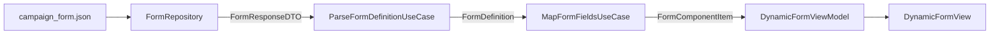

# DynoForm — Dynamic Form Builder (Server-Driven UI)

A single-screen iOS app that renders a form entirely from a local JSON payload. Built with Swift, SwiftUI, and MVVM + Clean Architecture for the Eulerity take-home exercise.

**Target:** iOS 16+ · Offline-only · Server-driven UI (SDUI)

---

## Architecture

```
JSON (Bundle)
  → FormRepository (decode DTO only)
  → ParseFormDefinitionUseCase (DTO → FormDefinition)
  → MapFormFieldsUseCase (API fields → FormComponentItem[])
  → DynamicFormViewModel (state, validation, submission)
  → DynamicFormView → DynamicComponentView → reusable components
```



### Layers

| Layer | Responsibility |
|-------|----------------|
| **Data** | Load/decode JSON (`FormRepository` → `FormResponseDTO`, `LossyDecodableArray`) |
| **Domain** | `FormDefinition`, `ParseFormDefinitionUseCase`, `MapFormFieldsUseCase`, `BuildFormSubmissionUseCase` |
| **Mapping** | Per-type `*FieldAPIMapper.swift` — `APIFieldProtocol` + `convertToComponentModel()` |
| **Presentation** | `DynamicFormViewModel`, SwiftUI views, `FormThemeEnvironment` |

### Key design choices

- **Repository is decode-only** — returns `FormResponseDTO`, not presentation models.
- **Validation lives on `FormComponentItem`** — `validated(using:markValidated:)` keeps per-type rules out of the ViewModel switch.
- **ID-based bindings** — `textBinding(for:)`, `validationState(for:)` use stable field ids, not array indices.
- **Explicit switches, not a plugin registry** — intentional for a take-home: easier to read and explain. See [ADDING_A_FIELD_TYPE.md](ADDING_A_FIELD_TYPE.md).

### Polymorphic parsing & resilience

- `APIFieldDTO` decodes `type` as `String`; unknown values (e.g. `DATE_PICKER`) → `.unknown` → skipped.
- `LossyDecodableArray` skips malformed field objects without failing the whole form.
- `MapFormFieldsUseCase` drops duplicate field ids (first wins, warning logged).
- `RegexPatternValidator` strips invalid `regex_pattern` values at mapping time (fail-safe, logged).

### State management

- ViewModel owns `[FormComponentItem]` and `[String: FieldValue]`.
- **Submit** — validates all fields; prints JSON + shows alert on success.
- **Blur** — text fields validate on focus leave via `validateField(id:)`.
- **Revalidation on edit** — only for fields already marked invalid (avoids noisy live validation).

---

## Engineering quality

After implementation, the codebase was reviewed with **OpenAI Codex** and improved with **Cursor** using a scoped fix list.

| Area | Improvement |
|------|-------------|
| List identity | ID-based bindings; `ForEach(components, id: \.id)` |
| Validation | `FormComponentItem.validated(using:markValidated:)` |
| Repository boundary | `fetchFormDTO` + `ParseFormDefinitionUseCase` |
| Regex safety | `RegexPatternValidator` at mapping time |
| Duplicate field ids | Deduped in `MapFormFieldsUseCase` with diagnostics |
| Validation UX | Blur validation on text fields + scroll to first error |
| Mapping layout | `Mapping/*FieldAPIMapper.swift` |

**Scope decisions:** Switch-based SDUI with a written extensibility checklist ([ADDING_A_FIELD_TYPE.md](ADDING_A_FIELD_TYPE.md)) instead of a plugin registry — appropriate for four field types and easier to review.

---

## Running the app

1. Open `DynoForm.xcodeproj` in Xcode  
2. Select an iOS 16+ simulator  
3. Run (`⌘R`)

Loads `campaign_form.json` from the bundle. In **DEBUG**, use **Form JSON** (top-right) to switch to `edge_cases_form`.

---

## Demo video

- A demo recording is included in the repository root as `Form Demo.mov`.
- The narration/flow script used for recording is in [DEMO_VIDEO_SCRIPT.md](DEMO_VIDEO_SCRIPT.md).

---

## Product decisions (not explicitly defined in spec)

1. **Validation timing** — Required errors on Submit; text fields also validate on blur. Other types revalidate on change only after first error.

2. **Unknown / malformed fields** — Silently skipped (no crash, no partial error UI) so incomplete server payloads still render usable forms.

3. **Dropdown defaults** — `default_values` filtered to valid option ids only.

4. **Checkbox / toggle defaults** — `default_value` from JSON seeds initial `FieldValue` state.

5. **Extensibility** — Switch-based SDUI with a written checklist rather than a runtime registry — readability over premature abstraction.

---

## Technical challenges addressed

- **Invalid regex from server** — Malformed patterns were skipped during validation. Fixed with `RegexPatternValidator` at mapping time.
- **Dynamic list state** — Refactored from index-based to stable id bindings for correct updates when fields change.
- **Focus + blur coordination** — Programmatic Next/Done focus moves guarded with `isProgrammaticFocusChange` to avoid spurious blur validation.
- **Polymorphic Codable** — String-based type decoding, `.unknown` case, and `LossyDecodableArray` for resilient parsing.

---

## Future enhancements

- Component registry when field types grow beyond a small set
- Snapshot / UI tests per component type
- Stricter domain entities (DTO → Entity → Presentation model)
- Accessibility identifiers for UI automation
- Persist draft form state between launches

---

## AI tool usage

Multi-tool workflow documented in [AI_COLLABORATION_LOG.md](AI_COLLABORATION_LOG.md):

- **ChatGPT** — initial architecture brief  
- **Claude** — reusable SwiftUI component library  
- **Cursor** — implementation, refactors, take-home completion, quality improvements  
- **Codex** — architecture review and post-fix validation  

---

## Related docs

| Doc | Purpose |
|-----|---------|
| [ADDING_A_FIELD_TYPE.md](ADDING_A_FIELD_TYPE.md) | Checklist for adding a new SDUI field type |
| [AI_COLLABORATION_LOG.md](AI_COLLABORATION_LOG.md) | Full AI collaboration record |
