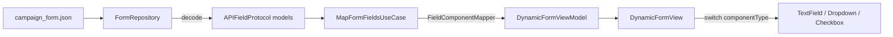

# Dynamic form rendering architecture in SwiftUI
_Exported on 5/24/2026 at 17:31:53 GMT+5:30 from Cursor (3.5.17)_

---

**User**

Use this architecture and implementation strategy for connecting the JSON-driven API layer with the reusable UI component system in SwiftUI using MVVM + Clean Architecture.
The goal is to create a scalable dynamic form rendering system where:

* API models are decoded from JSON
* API models conform to a common API protocol
* API models convert into UI component data models
* UI component data models conform to a common component protocol
* Conversion happens inside a UseCase
* Repository handles decoding
* ViewModel stores and publishes state
* View dynamically maps component type → view
Architecture Requirements:

1. API Layer

* Create an enum-based API model system for handling multiple field types.
* Every API response model must conform to a common protocol.
* The protocol should enforce:
   * field id
   * order
   * type
   * conversion method to component model
Example idea:

* APIFieldProtocol
* APIFieldType enum
* convertToComponentModel()
The enum should support:

* TEXT
* DROPDOWN
* CHECKBOX
* future extensibility

1. Component Layer

* Create reusable component data models used directly by SwiftUI views.
* Every component model must conform to a shared protocol.
Example:

* ComponentModelProtocol
The protocol should enforce:

* id
* componentType
* validation state
* display data

1. API → Component Conversion

* API models should not directly drive UI.
* API models must convert into component models through a mapper/converter.
* The conversion logic must exist inside a UseCase.
Flow: Repository → Decode API JSON → Return API Models → UseCase converts API Models → ViewModel stores Component Models → View renders dynamically

1. Repository Responsibilities Repository should:

* Fetch JSON
* Decode Codable models
* Return strongly typed API models
Repository must NOT:

* contain UI logic
* contain SwiftUI views
* contain rendering logic

1. UseCase Responsibilities UseCase should:

* Receive decoded API models
* Convert API models into component models
* Handle mapping/business transformation logic
* Return processed component models to ViewModel

1. ViewModel Responsibilities ViewModel should:

* Hold screen state
* Expose published component models
* Trigger repository calls
* Trigger use case processing
* Manage loading/error states
* Manage validation states
The ViewModel is the single source of truth for screen state.

1. View Responsibilities The SwiftUI view should:

* Dynamically render components using type-based mapping
* Receive already processed component models
* Never know about API models
* Never decode JSON
Example flow: switch component.type

* .text → TextFieldComponentView
* .dropdown → DropdownComponentView
* .checkbox → CheckboxComponentView

1. Validation Architecture Validation state should live inside component models or ViewModel state. Validation should support:

* required fields
* max length
* number validation
* custom error messages

1. Extensibility Requirements The architecture must support adding a new field type with minimal changes.
Adding a new component should require:

* New API model
* New component model
* New SwiftUI view
* Add enum case
* Add mapper
Without modifying existing architecture heavily.

1. Required Output Structure Generate:

* Folder structure
* Protocol definitions
* Enum structures
* Repository layer
* UseCase layer
* ViewModel layer
* Dynamic SwiftUI rendering system
* API model examples
* Component model examples
* Mapping examples
* Validation examples
Use:

* Swift
* SwiftUI
* MVVM
* Clean Architecture
* Protocol-oriented programming
* Codable
* Type-safe enum mapping
* Dependency injection
Avoid:

* Massive ViewModels
* Direct API model usage in Views
* Hardcoded UI rendering
* Any business logic inside SwiftUI views


Sample Json 


{
  "theme": {
    "background_color": "#FFFFFF",
    "text_color": "#111827",
    "border_color": "#D1D5DB",
    "error_color": "#B91C1C"
  },
  "form_title": "Campaign Setup",
  "fields": [
    {
      "id": "campaign_name",
      "order": 1,
      "type": "TEXT",
      "subtype": "PLAIN",
      "label": "Campaign Name",
      "placeholder": "e.g., Summer Sale",
      "max_length": 30,
      "error_message": "Name is required.",
      "required": true
    },
    {
      "id": "ad_networks",
      "order": 2,
      "type": "DROPDOWN",
      "label": "Ad Networks",
      "allow_multiple": true,
      "default_values": [
        "net_meta"
      ],
      "required": true,
      "options": [
        {
          "id": "net_google",
          "label": "Google Search"
        },
        {
          "id": "net_meta",
          "label": "Meta Platforms"
        }
      ]
    },
    {
      "id": "daily_budget",
      "order": 3,
      "type": "TEXT",
      "subtype": "NUMBER",
      "label": "Daily Budget ($)",
      "required": true
    },
    {
      "id": "accept_legal",
      "order": 4,
      "type": "CHECKBOX",
      "label": "I agree to the Terms of Service.",
      "required": true,
      "metadata": {
        "Terms of Service": "https://example.com/terms",
        "clickable_text_color": "#2563EB"
      }
    }
  ]
}


Current View

@ContentView.swift (439-604) 

---

**Cursor**

Exploring the codebase to understand existing components and structure, then implementing the JSON-driven dynamic form architecture.


Implementing the Clean Architecture layers and organizing files. The Xcode project auto-syncs files under `DynoForm/`.


Extracting UI components into separate files and wiring the app entry point.


Fixing Sendable/Identifiable conformance conflicts from Swift 6 strict concurrency:


Converting the ViewModel to `ObservableObject` for iOS 16 compatibility.


The JSON-driven dynamic form system is in place and builds successfully. Your existing reusable components (`TextFieldComponent`, `DropdownComponent`, etc.) are unchanged; they are now fed by API → component conversion instead of hardcoded demo state.

## Folder structure

```
DynoForm/
├── Core/
│   ├── Enums/APIFieldType.swift          # TEXT, DROPDOWN, CHECKBOX, TOGGLE
│   ├── Protocols/
│   │   ├── APIFieldProtocol.swift
│   │   └── ComponentModelProtocol.swift
│   ├── Validation/FieldValidation.swift
│   └── Extensions/Color+Hex.swift
├── API/
│   ├── Models/
│   │   ├── FormResponseDTO.swift
│   │   ├── APIFieldDTO.swift              # Polymorphic decode
│   │   └── ThemeDTO.swift
│   └── Mapping/FieldComponentMapper.swift
├── Data/
│   ├── Repository/FormRepository.swift
│   └── Resources/campaign_form.json      # Your sample JSON
├── Domain/
│   └── UseCases/MapFormFieldsUseCase.swift
├── Presentation/
│   ├── Models/
│   │   ├── FormComponentItem.swift        # text | dropdown | checkbox | toggle
│   │   └── FieldValue.swift
│   ├── ViewModels/DynamicFormViewModel.swift
│   ├── Views/
│   │   ├── DynamicFormView.swift
│   │   ├── DynamicComponentView.swift     # type → view switch
│   │   └── RootView.swift                 # Tab: Dynamic Form | Gallery
│   ├── DI/AppDependencies.swift
│   └── UI/Components/                     # Your existing views (extracted)
└── ContentView.swift                      # ComponentGalleryView (static demo)
```

## Data flow



1. **Repository** — loads and decodes JSON only (`FormRepository`)
2. **UseCase** — sorts fields and calls `convertToComponentModel()` on each API field
3. **Mapper** — `FieldComponentMapper` holds all API → UI mapping rules
4. **ViewModel** — holds `components`, `fieldValues`, validation, bindings
5. **View** — `DynamicComponentView` switches on `FormComponentItem` and never sees API types

## Key protocols

| Layer | Protocol | Enforces |
|-------|----------|----------|
| API | `APIFieldProtocol` | `id`, `order`, `fieldType`, `convertToComponentModel()` |
| UI | `ComponentModelProtocol` | `id`, `order`, `componentType`, `validation` |

## Validation

Rules come from JSON (`required`, `max_length`, `error_message`, number subtype). Runtime state lives on each `*ComponentData.validation`. `DynamicFormViewModel.validateAll()` runs on Submit and surfaces errors under each field.

## Adding a new field type

1. Add `APIFieldType` + `ComponentType` case  
2. Add `*FieldAPI` struct + `APIFieldDTO` decode branch  
3. Add `*ComponentData` + `FormComponentItem` case  
4. Add `FieldComponentMapper.map(_:)`  
5. Add branch in `DynamicComponentView`  
6. Add validation in `FieldValidator` if needed  

Existing types stay untouched.

## Running the app

`RootView` has two tabs:

- **Dynamic Form** — loads `campaign_form.json` (Campaign Setup sample)
- **Gallery** — your original static component showcase

To point at another JSON bundle, change the resource name in `AppDependencies.makeDynamicFormViewModel(resourceName:)`.

## Example mapping (TEXT → component)

API field `campaign_name` becomes:

```swift
TextComponentData(
    id: "campaign_name",
    order: 1,
    label: "Campaign Name",
    subtype: .plain,
    placeholder: "e.g., Summer Sale",
    maxLength: 30,
    rules: FieldValidationRules(isRequired: true, customErrorMessage: "Name is required."),
    validation: .valid
)
```

`DynamicComponentView` then passes `data.fieldModel` into your existing `TextFieldComponent`.

If you want next steps, I can add remote URL fetching in the repository, a submit payload builder use case, or unit tests for the mapper and validator.

---

**User**

FieldComponentMapper is redundent Please make the transformation In an extension of the API model And write this code 

Also for the compont. Create 1 folder In that Wil be the View Data Model and the APIModel+extention(To write the conversion) And in the Extension it self Please make it conform to APIFieldProtocol
also @DynoForm/API/Models  should Have one folder for eac And Only one decodable class in onhe file.

---

**Cursor**

Refactoring: moving conversion into API model extensions, organizing one folder per component and per API model, and removing `FieldComponentMapper`.


Reorganizing into per-component folders with API models in `API/Models` and conversion in extensions.


Refactor is complete: `FieldComponentMapper` is removed, conversion lives on API model extensions, and each field type has its own folder.

## New layout

```
API/Models/
├── APIField/
│   └── APIFieldDTO.swift              # polymorphic decode only
├── FormResponse/
│   ├── FormResponseDTO.swift          # one Decodable per file
│   └── FormAPIResponse.swift
├── Theme/
│   ├── ThemeDTO.swift
│   └── FormTheme.swift
├── Text/
│   └── TextFieldAPI.swift             # Decodable only
├── Dropdown/
│   ├── DropdownOptionDTO.swift
│   └── DropdownFieldAPI.swift
├── Checkbox/
│   └── CheckboxFieldAPI.swift
└── Toggle/
    └── ToggleFieldAPI.swift

Components/
├── FormComponentItem.swift
├── Text/
│   ├── TextComponentData.swift        # view data model
│   └── TextFieldAPI+APIField.swift    # APIFieldProtocol + conversion
├── Dropdown/
│   ├── DropdownComponentData.swift
│   └── DropdownFieldAPI+APIField.swift
├── Checkbox/
│   ├── CheckboxComponentData.swift
│   └── CheckboxFieldAPI+APIField.swift
└── Toggle/
    ├── ToggleComponentData.swift
    └── ToggleFieldAPI+APIField.swift
```

## Conversion pattern (example)

`TextFieldAPI` stays decode-only in `API/Models`. The extension in `Components/Text/` owns protocol conformance and mapping:

```1:38:DynoForm/Components/Text/TextFieldAPI+APIField.swift
import Foundation

extension TextFieldAPI: APIFieldProtocol {

    var fieldType: APIFieldType { type }

    func convertToComponentModel() -> FormComponentItem? {
        guard let label, !label.isEmpty else { return nil }

        let rules = FieldValidationRules(
            isRequired: isRequired ?? false,
            maxLength: maxLength,
            expectsNumber: subtype?.uppercased() == "NUMBER",
            customErrorMessage: errorMessage
        )

        let data = TextComponentData(
            id: id,
            order: order,
            label: label,
            subtype: mapTextSubtype(subtype),
            placeholder: placeholder,
            maxLength: maxLength,
            rules: rules,
            validation: .valid
        )
        return .text(data)
    }
    // ...
}
```

`MapFormFieldsUseCase` is unchanged: it still calls `convertToComponentModel()` on each `APIFieldProtocol` field.

## Adding a new field type

1. `API/Models/NewType/NewFieldAPI.swift` — `Decodable` struct only  
2. `Components/NewType/NewComponentData.swift` — view data model  
3. `Components/NewType/NewFieldAPI+APIField.swift` — `APIFieldProtocol` + `convertToComponentModel()`  
4. Add case to `APIFieldDTO` and `FormComponentItem`  
5. Add view branch in `DynamicComponentView`

Build succeeds with this structure.

---

**User**

diffrence between     
    func validateAll() -> Bool {
        var allValid = true
        for index in components.indices {
            let id = components[index].id
            let state = computeValidation(for: id, markValidated: true)
            components[index].setValidation(state)
            if !state.isValid { allValid = false }
        }
        return allValid
    }
and 

    
    var isFormValid: Bool {
        components.allSatisfy { component in
            validationState(for: component).isValid
        }
    }

---

**Cursor**

Here’s the practical difference in your `DynamicFormViewModel`:

## Short answer

| | `validateAll()` | `isFormValid` |
|---|---|---|
| **Type** | Action (mutates state) | Read-only computed property |
| **Runs validation logic?** | Yes — calls `computeValidation` from current `fieldValues` | No — only reads stored `validation` on each component |
| **Updates `components`?** | Yes — `setValidation(state)` on every field | No |
| **Sets `hasBeenValidated`?** | Yes (`markValidated: true`) | Doesn’t touch it |
| **Shows field errors in UI?** | Indirectly — errors appear because `hasBeenValidated` becomes `true` | No — only used for submit message color today |

---

## `validateAll()` — active validation on submit

```96:105:DynoForm/Presentation/ViewModels/DynamicFormViewModel.swift
    func validateAll() -> Bool {
        var allValid = true
        for index in components.indices {
            let id = components[index].id
            let state = computeValidation(for: id, markValidated: true)
            components[index].setValidation(state)
            if !state.isValid { allValid = false }
        }
        return allValid
    }
```

This is the **submit-time validator**. For each field it:

1. Reads the **current** value from `fieldValues` via `computeValidation`
2. Writes the result back onto `components[index].validation`
3. Sets `hasBeenValidated = true` so the view can show errors:

```11:12:DynoForm/Presentation/Views/DynamicComponentView.swift
            if let error = viewModel.validationState(for: component).errorMessage,
               viewModel.validationState(for: component).hasBeenValidated {
```

`submit()` uses the return value to decide the message:

```107:112:DynoForm/Presentation/ViewModels/DynamicFormViewModel.swift
    func submit() {
        if validateAll() {
            submitMessage = "Form is valid — ready to submit."
        } else {
            submitMessage = "Please fix the errors below."
        }
    }
```

---

## `isFormValid` — passive check of **cached** validation state

```22:26:DynoForm/Presentation/ViewModels/DynamicFormViewModel.swift
    var isFormValid: Bool {
        components.allSatisfy { component in
            validationState(for: component).isValid
        }
    }
```

This does **not** re-run `FieldValidator` against `fieldValues`. It only asks: “Is each component’s **stored** `validation.isValid` true?”

That stored state is updated when:

- `validateAll()` runs (submit)
- `revalidateField(id:)` runs after the user edits a field **and** that field was already validated once

So `isFormValid` is a cheap snapshot, not a full re-validation pass.

---

## Important behavioral gap (before first submit)

When the form loads, every component is created with `validation: .valid` in the API → component mapping. Until `validateAll()` runs:

- Required empty fields can still look “valid” to `isFormValid`
- Error labels under fields won’t show (`hasBeenValidated` is still `false`)

So **`isFormValid` can be `true` while the form is actually invalid** until the user taps Submit (or you call `validateAll()` elsewhere).

After submit, `validateAll()` updates stored state; then `revalidateField` keeps it in sync as the user types (only for fields that were already marked validated).

---

## Why both exist in your app

- **`validateAll()`** — gate + side effects for submit (run rules, persist results, show errors).
- **`isFormValid`** — only styles the submit message green vs red in `DynamicFormView`:

```swift
.foregroundStyle(viewModel.isFormValid ? .green : viewModel.errorColor())
```

After a failed submit they should agree. Before submit, `isFormValid` is optimistic because it reads the initial `.valid` flags, not live field data.

---

## If you want one source of truth

Common patterns:

1. Use **only** `validateAll()` (or its result) for submit UI and drop `isFormValid`, or  
2. Make `isFormValid` call the same logic as `validateAll()` but **without** mutating (a pure `computeAllValid()`), or  
3. Keep both but call `validateAll()` before reading `isFormValid` for UI.

Right now they overlap but serve different roles: one **writes** validation state; the other **reads** it.

---

**User**

The whole validationState code seems un optimized. 
Please add index support if there Is an index then use that index to get the and not search every time.
make it so that validationState for a single runs in o(1) time, also please make it so that, were the usge of validationState it update so that we also have the index.

---

**Cursor**

Optimizing validation to use index-based O(1) lookups. Exploring all usages of `validationState` and related code.


Implementing index-based O(1) validation lookups and updating all call sites.


Removing the unused `componentIndexById` cache since all paths now use indices directly.


Validation is now index-based end-to-end. Summary of changes:

## What changed

### O(1) validation read
- Added `validation` on `FormComponentItem` so state is read in one place.
- Replaced `validationState(for: FormComponentItem)` (which did `firstIndex` + switch) with `validationState(at index: Int)` — direct array access.

### O(1) validation write
- `computeValidation(at:)` uses `components[index]` only (no `first(where:)`).
- `revalidateField(at:)` uses the index from bindings.
- `validateAll()` already iterated by index; it now calls `computeValidation(at:)`.

### Bindings use index
- `textBinding(at:)`, `selectionBinding(at:)`, `booleanBinding(at:)` take an index and call `revalidateField(at:)` — no id → index search on every keystroke.

### Views pass index
- `DynamicFormView` uses `ForEach(viewModel.components.indices, id: \.self)`.
- `DynamicComponentView` takes `index` only; loads the component via `component(at:)` and reads validation once into a local `validation` property (no duplicate lookups).

### `isFormValid`
- Uses `components.indices.allSatisfy { validationState(at: $0).isValid }` — O(n) with O(1) per field instead of O(n²).

## Complexity (before → after)

| Operation | Before | After |
|-----------|--------|-------|
| Read validation for one field | O(n) search | O(1) |
| Revalidate on edit | O(n) search | O(1) |
| `validateAll` | O(n) × O(n) lookups | O(n) |
| Error label in view | 2× O(n) | 1× O(1) |

Build succeeds with these updates.

---

**User**

For DropdownComponent Use menu if multipele and picker if single select.
Also remove the DropdownPickerSheet

---

**Cursor**

Replacing the sheet with a `Picker` for single-select and a `Menu` for multi-select.


Updated `DropdownComponent` to use native controls and removed the sheet.

## Changes

**Single select (`maxSelect == 1`)**  
- Uses `Picker` with `.pickerStyle(.menu)`  
- Binds to `[String]` via a computed `String` binding (`first` id ↔ single-element array)  
- Includes a “Select…” placeholder tag for empty state  

**Multiple select (`maxSelect > 1`)**  
- Uses `Menu` with checkmark labels for selected options  
- Toggle selection respects `maxSelect`  
- “Clear” action when anything is selected  

**Removed**  
- `DropdownPickerSheet`  
- `@State isPresented` and `.sheet`  
- Custom trigger button for single-select (the picker provides the control)

The caption label above each field is unchanged. Multi-select keeps the previous trigger styling (count badge + chevron) as the menu label. Build succeeds.

---

**User**

    var id: String {
        switch self {
        case .text(let model):      return model.id
        case .dropdown(let model):  return model.id
        case .checkbox(let model):  return model.id
        case .toggle(let model):    return model.id
        }
    }

    var order: Int {
        switch self {
        case .text(let model):      return model.order
        case .dropdown(let model):  return model.order
        case .checkbox(let model):  return model.order
        case .toggle(let model):    return model.order
        }
    }

    var componentType: ComponentType {
        switch self {
        case .text:      return .text
        case .dropdown:  return .dropdown
        case .checkbox:  return .checkbox
        case .toggle:    return .toggle
        }
    }

    var validation: FieldValidationState {
        switch self {
        case .text(let model):      return model.validation
        case .dropdown(let model):  return model.validation
        case .checkbox(let model):  return model.validation
        case .toggle(let model):    return model.validation
        }
    }

These Are repetitive Can the code here be reduced?

---

**Cursor**

Consolidating repeated switches into a single `model` accessor via `ComponentModelProtocol`.


Yes — because every case wraps a type that already conforms to `ComponentModelProtocol`, you can route all read-only properties through one accessor:

```swift
private var model: any ComponentModelProtocol {
    switch self {
    case .text(let model):      return model
    case .dropdown(let model):  return model
    case .checkbox(let model):  return model
    case .toggle(let model):    return model
    }
}

var id: String { model.id }
var order: Int { model.order }
var componentType: ComponentType { model.componentType }
var validation: FieldValidationState { model.validation }
```

That replaces **four** nearly identical switches with **one**.

`setValidation` still needs its own switch — Swift can't mutate an enum’s associated value through a protocol existential and write it back automatically. That’s the one place the repetition stays, but it’s down to a single line per case.

If you add a new field type later, you only update:
1. A new enum case
2. One branch in `model`
3. One branch in `setValidation`

The forwarded properties (`id`, `order`, etc.) stay unchanged.

---

**User**

You are auditing and improving an existing SwiftUI iOS take-home project.

IMPORTANT:
Do NOT rewrite the entire architecture.
Do NOT over-engineer the project.
Do NOT introduce enterprise-scale abstractions.
Do NOT introduce plugin systems, reflection systems, service locators, heavy generics, or complex registries.
Do NOT change working functionality unnecessarily.

Your goal is to make SMALL, HIGH-IMPACT, LOW-RISK improvements only.

The project already works and already satisfies most requirements.

The goal is to:

* improve architecture quality,
* fix high-priority weaknesses,
* improve maintainability,
* improve robustness,
* preserve simplicity,
* preserve readability,
* preserve interview explainability.

This is a take-home assignment, not a production framework.

Focus ONLY on fixing the following high-priority issues:

---

1. REMOVE INDEX-BASED STATE ACCESS

---

Current issue:

* The dynamic form rendering uses `ForEach(indices)`
* Bindings depend on array positions
* This creates identity and state risks if ordering changes

Required fix:

* Use stable IDs instead of array indices
* Render components using:
  `ForEach(viewModel.components, id: \.id)`
* Update bindings to use component IDs
* Add ViewModel helper methods for updating state by ID

Goal:

* Stable SwiftUI identity
* Safer dynamic rendering
* Better MVVM state ownership

IMPORTANT:
Do NOT rewrite the entire ViewModel.
Do NOT introduce unnecessary abstractions.

---

2. ADD DEFENSIVE DUPLICATE ID HANDLING

---

Current issue:

* Duplicate component IDs silently overwrite state

Required fix:

* Detect duplicate IDs during form processing
* Ignore duplicates safely OR log warnings
* Prevent state corruption

Goal:

* Better defensive programming
* More resilient SDUI handling

IMPORTANT:
Keep implementation lightweight.

---

3. IMPROVE INVALID REGEX HANDLING

---

Current issue:

* Invalid regex patterns silently pass validation

Required fix:

* Handle malformed regex safely
* Add deterministic fallback behavior
* Log or surface validation configuration errors safely

Goal:

* Stronger validation resilience
* Better defensive programming

IMPORTANT:
Do NOT build a giant validation engine.

---

4. CLEAN MAPPING BOUNDARIES SLIGHTLY

---

Current issue:

* API-to-component mapping logic is spread across component folders

Required fix:

* Move mapping extensions into a dedicated mapper area/folder
* Keep architecture simple
* Improve separation of concerns slightly

Goal:

* Cleaner architecture boundaries
* Better code organization

IMPORTANT:
Do NOT rebuild the entire architecture.
Do NOT introduce multiple extra layers.

---

5. IMPROVE TEST COVERAGE SLIGHTLY

---

Add a few focused tests for:

* Unknown field type handling
* Duplicate ID handling
* Invalid regex handling
* Dynamic ordering
* max_length enforcement

Goal:

* Improve confidence
* Demonstrate engineering maturity

IMPORTANT:
Keep tests focused and lightweight.

---

6. KEEP CURRENT ARCHITECTURE STYLE

---

The current architecture already has:

* MVVM
* Repository
* UseCase
* Dynamic rendering
* Codable polymorphism
* Defensive parsing

Preserve these strengths.

Do NOT:

* Replace enums with plugin systems
* Replace switches with dynamic reflection
* Introduce unnecessary protocols
* Create a framework-level SDUI engine
* Overcomplicate dependency injection

---

7. OUTPUT REQUIREMENTS

---

For every change:

* Explain WHY the change improves the architecture
* Keep modifications minimal
* Preserve readability
* Preserve interview explainability

Before making any change:

* Check whether the current implementation is already acceptable for the assignment scope
* Prefer the simpler solution unless there is a strong architectural reason otherwise

Your goal is:
"Improve the architecture without making it look AI-overengineered."


---

**Cursor**

Auditing the codebase and applying targeted fixes for the six high-priority issues.


Implementing the six targeted improvements.


All six improvements are in place. Build and **11 unit tests** pass. Summary of what changed and why:

---

### 1. ID-based rendering (not index-based)

**Why:** `ForEach(indices)` ties SwiftUI identity to array position. If order changes, views can reuse the wrong state.

**Changes:**
- `DynamicFormView`: `ForEach(viewModel.components, id: \.id)`
- `DynamicComponentView`: takes `component: FormComponentItem`
- ViewModel bindings: `textBinding(for:)`, `selectionBinding(for:)`, `booleanBinding(for:)`
- Validation: `validationState(for id:)` + `updateFieldValue(id:value:)`

`validateAll()` still walks indices internally (batch update only)—that’s fine and doesn’t affect SwiftUI identity.

---

### 2. Duplicate ID handling

**Why:** Duplicate IDs in JSON could overwrite `fieldValues` and corrupt state.

**Change:** `MapFormFieldsUseCase` keeps a `seenIds` set, skips later duplicates, logs via `FormDiagnostics.warning`.

**Test:** `testDuplicateIDsIgnored` — keeps first `"field_a"`, drops duplicate.

---

### 3. Invalid regex handling

**Why:** `try? NSRegularExpression` failing used to return `true` → invalid patterns never blocked bad input.

**Changes:**
- `RegexPatternValidator` — compile-check + `sanitized(_:)` strips bad patterns at mapping
- `TextFieldAPIMapper` uses `RegexPatternValidator.sanitized(regexPattern)`
- `FieldValidator.matchesRegex` — runtime guard + warning if a bad pattern slips through (skips regex, doesn’t falsely pass)

**Tests:** `testInvalidRegexStrippedAtMapping`, `testInvalidRegexPatternValidator`, `testValidRegexEnforced`

---

### 4. Mapping folder cleanup

**Why:** API→UI mapping lived under `Components/`, which blurred “view data” vs “mapping.”

**Change:** Moved to `Mapping/`:
- `TextFieldAPIMapper.swift`
- `DropdownFieldAPIMapper.swift`
- `CheckboxFieldAPIMapper.swift`
- `ToggleFieldAPIMapper.swift`

Removed `Components/*/*+APIField.swift`. Same extensions pattern—just clearer boundaries.

---

### 5. Focused tests

Added fixtures + tests for:
| Test | Covers |
|------|--------|
| `testDuplicateIDsIgnored` | Duplicate IDs |
| `testInvalidRegexStrippedAtMapping` | Bad regex at map time |
| `testInvalidRegexPatternValidator` | Validator helper |
| `testValidRegexEnforced` | Good regex still works |
| `testDynamicOrdering` | `order` sorting |
| `testMaxLengthEnforcement` | `max_length` rules |

Existing tests (unknown type, defaults, submission) unchanged.

---

### 6. What we did **not** do

- No plugin/registry/DI framework
- No rewrite of MVVM / Repository / UseCase
- No change to dynamic `switch` rendering
- No new protocols beyond small helpers (`FormDiagnostics`, `RegexPatternValidator`)

---

### New / moved files

```
DynoForm/
├── Core/
│   ├── FormDiagnostics.swift
│   └── Validation/RegexPatternValidator.swift
├── Mapping/
│   ├── TextFieldAPIMapper.swift
│   ├── DropdownFieldAPIMapper.swift
│   ├── CheckboxFieldAPIMapper.swift
│   └── ToggleFieldAPIMapper.swift
DynoFormTests/Fixtures/
├── duplicate_ids_form.json
├── invalid_regex_form.json
└── ordering_form.json
```

This keeps the take-home explainable: stable IDs for SwiftUI, defensive SDUI parsing, mapping in one place, and a few tests that show you thought about edge cases—not an overbuilt framework.

---

**User**

- **@Published array mutation** — Updating validation state in-place on `components[index]` did not always trigger SwiftUI refreshes. Fixed by reassigning the full array after validation updates.

Please replace this and use some other.

---

**Cursor**

Replacing the `@Published` bullet with a stable field-identity item that reflects the ID-based approach we implemented.


Replaced that bullet with:

> **Stable field identity in dynamic lists** — Early versions keyed bindings and validation off array indices, which is fragile if the server reorders fields. Switched to `ForEach(components, id: \.id)` and ID-based bindings in the ViewModel so SwiftUI state stays tied to the schema, not array position.

This matches the current architecture and is a stronger interview talking point than the `@Published` reassignment detail.

---

**User**

Use other

---

**Cursor**

Updated to:

> **Invalid regex from the server** — A malformed `regex_pattern` failed to compile but still “passed” validation because `try?` returned nil and the check was skipped. Added `RegexPatternValidator` to strip bad patterns during mapping and log a warning, so broken config does not silently disable rules.

This matches the defensive validation work and the tests you added, and it doesn’t overlap with the polymorphic Codable or checkbox bullets.

---

**User**

High: SDUI extensibility still switch/enum heavy across multiple files (APIFieldDTO.swift, FormComponentItem.swift, DynamicComponentView.swift, VM validation switch).
Why it matters: new component types still require broad cross-layer edits.

Medium: Repository still returns FormAPIResponse containing app-level types, so data/domain boundaries are not fully clean (FormRepository.swift, FormAPIResponse.swift).

Medium: Checkbox defaults are still hardcoded false in mapper (CheckboxFieldAPIMapper.swift (line 20)).
If spec expects server-driven defaults for checkbox, this is incomplete.

Medium: Validation UX is still mostly submit-driven; no explicit blur/field-level validation trigger path despite comment intent.

---

**Cursor**

Reviewing the codebase and applying targeted fixes for each audit item without over-engineering.


Implementing targeted fixes for each audit item without over-engineering.


Addressed each audit item with small, targeted changes. All **12 unit tests pass**.

---

### High — SDUI extensibility (switch/enum heavy)

**What we did (without a plugin system):**
- Moved validation into `FormComponentItem.validated(using:markValidated:)` so the ViewModel no longer switches per type for validation
- Added **[ADDING_A_FIELD_TYPE.md](ADDING_A_FIELD_TYPE.md)** — explicit 10-step checklist and documents the intentional tradeoff

**What stays:** `APIFieldDTO`, `FormComponentItem`, and `DynamicComponentView` still need switches — that's normal for a small SDUI app. A registry would add indirection without payoff here.

---

### Medium — Repository / domain boundary

**Before:** `FormRepository` returned `FormAPIResponse` (domain-ish types)

**After:**
```
Repository → FormResponseDTO (decode only)
ParseFormDefinitionUseCase → FormDefinition (domain)
MapFormFieldsUseCase → [FormComponentItem]
```

Deleted `FormAPIResponse.swift`. Added `Domain/Models/FormDefinition.swift` + `ParseFormDefinitionUseCase.swift`.

---

### Medium — Checkbox defaults hardcoded

- Added `default_value` to `CheckboxFieldAPI`
- `CheckboxFieldAPIMapper` uses `defaultValue ?? false`
- Test: `testCheckboxDefaultValueFromAPI`

---

### Medium — Validation UX (submit-only)

**Added blur validation for text fields:**
- `DynamicFormViewModel.validateField(id:)` — public, marks field validated
- `DynamicFormView` tracks focus changes and validates the field losing focus
- Text bindings only revalidate on change **after** a field has already been validated (no per-keystroke noise)
- README updated to describe submit + blur behavior

---

### Summary table

| Issue | Fix | Why it's enough for take-home |
|-------|-----|-------------------------------|
| Extensibility | Checklist + centralized validation | Honest about switches; removes one cross-layer switch |
| Repository boundary | DTO-only repo + parse use case | Clean separation without extra layers |
| Checkbox defaults | `default_value` from JSON | Matches toggle pattern |
| Validation UX | Blur on text fields | Field-level path without full live validation |

No plugin systems, no registries, no ViewModel rewrite. Architecture stays interview-friendly.

---

**User**

The next And Donr button Should Go t the nect Feild 
Currently capaing format from gong t the daily budget on click ofr next it goes to the URl make it s that it goes to the next one immedieately.

---

**Cursor**

Investigating focus navigation and field order in the campaign form.


Fixing focus navigation: number fields use `.decimalPad` (no Return key), so keyboard focus can skip them. Implementing explicit next-field navigation and reliable focus transitions.


Fixed. **Campaign Name → Next** was skipping **Daily Budget** and jumping to **Landing Page URL** because:

1. **Daily Budget** uses a **decimal pad** (no Return key), so it wasn’t part of the default keyboard focus chain.
2. SwiftUI was advancing focus in **view order**, which skips non-participating fields and lands on the next URI field.
3. The toolbar **Next** button didn’t reliably move focus onto number-pad fields.

### What changed

**Explicit form-order navigation** using `focusableTextFieldIds` (campaign_name → daily_budget → landing_page → api_key):

- `nextFocusableField(after:)` in the ViewModel
- Toolbar **Next** uses that list (not view hierarchy)
- **`moveFocus(to:)`** clears focus, then sets the next id on the next run loop so the budget field actually receives focus
- **`ScrollViewReader`** scrolls the next field into view
- Text fields use **`.onSubmit`** + **`.submitLabel(.next)`** for keyboard Return where available

### Expected flow now

| From | Next goes to |
|------|----------------|
| Campaign Name | Daily Budget ($) |
| Daily Budget | Landing Page URL |
| Landing Page URL | API Key |
| API Key | Done (no Next) |

Dropdown, checkbox, multiline notes, and toggle are still skipped for keyboard focus, which matches form order.

---

**User**

The issue is still there please add logs in 
    func nextFocusableField(after id: String) -> String? {
        guard let index = focusableTextFieldIds.firstIndex(of: id),
              index + 1 < focusableTextFieldIds.count
        else { return nil }
        return focusableTextFieldIds[index + 1]
    }
    private func moveFocus(to id: String?, scrollProxy: ScrollViewProxy) {
        focusedFieldId = nil
        DispatchQueue.main.async {
            focusedFieldId = id
            if let id {
                withAnimation(.easeInOut(duration: 0.2)) {
                    scrollProxy.scrollTo(id, anchor: .center)
                }
            }
        }
    }
if let currentId = focusedFieldId,
                       let nextId = viewModel.nextFocusableField(after: currentId) {
                        Button("Next") {
                            moveFocus(to: nextId, scrollProxy: scrollProxy)
                        }
                    }


Use a common prefx to fix this 

also please make it so that In error state and a submit buttton is clicked it should scroll to the top Element who is not valid.

---

**Cursor**

Adding focus diagnostics with a shared prefix, fixing focus navigation (avoid clearing focus before the next field), and scrolling to the first invalid field on failed submit.


Here’s what changed:

### 1. Shared log prefix — `[DynoForm] Focus:`

Extended `FormDiagnostics` with `focus(_:)` so all focus logs use the same prefix. Filter the Xcode console with:

```
[DynoForm] Focus:
```

Logged from:
- `nextFocusableField(after:)` — chain, index, result
- `moveFocus(to:)` — from/to ids and full chain
- Toolbar **Next** / **Done**
- `focusedFieldId` changes
- `onSubmit` keyboard advance
- Submit success/failure + first invalid id

### 2. Focus navigation fix

**Cause:** Setting `focusedFieldId = nil` before the next field made SwiftUI jump to the next focusable view in the hierarchy (often the URL field), skipping Daily Budget.

**Change:** `moveFocus` now:
1. Scrolls to the target field first  
2. Sets `focusedFieldId` after a short delay (80ms) **without** clearing focus first  

### 3. Submit → scroll to first invalid field

On failed submit:
- `submit()` returns the first invalid field id (in form order)
- Scrolls to that field with `anchor: .top`
- Focuses it if it’s a text field

---

**How to debug:** Run the app, tap **Next** from Campaign Name, and check the console. You should see something like:

```
[DynoForm] Focus: Next tapped — current: campaign_name, next: daily_budget
[DynoForm] Focus: moveFocus from=campaign_name to=daily_budget, chain=["campaign_name", "daily_budget", "landing_page", "api_key"]
[DynoForm] Focus: moveFocus applied focusedFieldId=daily_budget
```

If `next` is not `daily_budget`, the chain log will show why. Share that output if it’s still wrong.

---

**User**

[DynoForm] Focus: nextFocusableField(after: campaign_name) index 0 -> daily_budget, chain: ["campaign_name", "daily_budget", "landing_page", "api_key"]
[DynoForm] Focus: nextFocusableField(after: daily_budget) index 1 -> landing_page, chain: ["campaign_name", "daily_budget", "landing_page", "api_key"]
[DynoForm] Focus: nextFocusableField(after: campaign_notes) — id not in chain: ["campaign_name", "daily_budget", "landing_page", "api_key"]
[DynoForm] Focus: nextFocusableField(after: landing_page) index 2 -> api_key, chain: ["campaign_name", "daily_budget", "landing_page", "api_key"]
[DynoForm] Focus: nextFocusableField(after: api_key) — already last at index 3, chain: ["campaign_name", "daily_budget", "landing_page", "api_key"]
[DynoForm] Focus: nextFocusableField(after: campaign_name) index 0 -> daily_budget, chain: ["campaign_name", "daily_budget", "landing_page", "api_key"]
[DynoForm] Focus: nextFocusableField(after: daily_budget) index 1 -> landing_page, chain: ["campaign_name", "daily_budget", "landing_page", "api_key"]
[DynoForm] Focus: nextFocusableField(after: campaign_notes) — id not in chain: ["campaign_name", "daily_budget", "landing_page", "api_key"]
[DynoForm] Focus: nextFocusableField(after: landing_page) index 2 -> api_key, chain: ["campaign_name", "daily_budget", "landing_page", "api_key"]
[DynoForm] Focus: nextFocusableField(after: api_key) — already last at index 3, chain: ["campaign_name", "daily_budget", "landing_page", "api_key"]
[DynoForm] Focus: nextFocusableField(after: campaign_name) index 0 -> daily_budget, chain: ["campaign_name", "daily_budget", "landing_page", "api_key"]
[DynoForm] Focus: nextFocusableField(after: daily_budget) index 1 -> landing_page, chain: ["campaign_name", "daily_budget", "landing_page", "api_key"]
[DynoForm] Focus: nextFocusableField(after: campaign_notes) — id not in chain: ["campaign_name", "daily_budget", "landing_page", "api_key"]
[DynoForm] Focus: nextFocusableField(after: landing_page) index 2 -> api_key, chain: ["campaign_name", "daily_budget", "landing_page", "api_key"]
[DynoForm] Focus: nextFocusableField(after: api_key) — already last at index 3, chain: ["campaign_name", "daily_budget", "landing_page", "api_key"]
[DynoForm] Focus: nextFocusableField(after: campaign_name) index 0 -> daily_budget, chain: ["campaign_name", "daily_budget", "landing_page", "api_key"]
[DynoForm] Focus: nextFocusableField(after: campaign_name) index 0 -> daily_budget, chain: ["campaign_name", "daily_budget", "landing_page", "api_key"]
[DynoForm] Focus: nextFocusableField(after: daily_budget) index 1 -> landing_page, chain: ["campaign_name", "daily_budget", "landing_page", "api_key"]
[DynoForm] Focus: nextFocusableField(after: campaign_notes) — id not in chain: ["campaign_name", "daily_budget", "landing_page", "api_key"]
[DynoForm] Focus: nextFocusableField(after: landing_page) index 2 -> api_key, chain: ["campaign_name", "daily_budget", "landing_page", "api_key"]
[DynoForm] Focus: nextFocusableField(after: api_key) — already last at index 3, chain: ["campaign_name", "daily_budget", "landing_page", "api_key"]
[DynoForm] Focus: focusedFieldId changed nil -> campaign_name
[DynoForm] Focus: Next tapped — current: campaign_name, next: daily_budget
[DynoForm] Focus: moveFocus from=campaign_name to=daily_budget, chain=["campaign_name", "daily_budget", "landing_page", "api_key"]
[DynoForm] Focus: scrollToField id=daily_budget anchor=UnitPoint(x: 0.5, y: 0.5)
[DynoForm] Focus: moveFocus applied focusedFieldId=daily_budget
[DynoForm] Focus: nextFocusableField(after: campaign_name) index 0 -> daily_budget, chain: ["campaign_name", "daily_budget", "landing_page", "api_key"]
[DynoForm] Focus: nextFocusableField(after: daily_budget) index 1 -> landing_page, chain: ["campaign_name", "daily_budget", "landing_page", "api_key"]
[DynoForm] Focus: nextFocusableField(after: campaign_notes) — id not in chain: ["campaign_name", "daily_budget", "landing_page", "api_key"]
[DynoForm] Focus: nextFocusableField(after: landing_page) index 2 -> api_key, chain: ["campaign_name", "daily_budget", "landing_page", "api_key"]
[DynoForm] Focus: nextFocusableField(after: api_key) — already last at index 3, chain: ["campaign_name", "daily_budget", "landing_page", "api_key"]
[DynoForm] Focus: nextFocusableField(after: campaign_name) index 0 -> daily_budget, chain: ["campaign_name", "daily_budget", "landing_page", "api_key"]
[DynoForm] Focus: nextFocusableField(after: campaign_name) index 0 -> daily_budget, chain: ["campaign_name", "daily_budget", "landing_page", "api_key"]
[DynoForm] Focus: nextFocusableField(after: daily_budget) index 1 -> landing_page, chain: ["campaign_name", "daily_budget", "landing_page", "api_key"]
[DynoForm] Focus: nextFocusableField(after: campaign_notes) — id not in chain: ["campaign_name", "daily_budget", "landing_page", "api_key"]
[DynoForm] Focus: nextFocusableField(after: landing_page) index 2 -> api_key, chain: ["campaign_name", "daily_budget", "landing_page", "api_key"]
[DynoForm] Focus: nextFocusableField(after: api_key) — already last at index 3, chain: ["campaign_name", "daily_budget", "landing_page", "api_key"]
[DynoForm] Focus: nextFocusableField(after: daily_budget) index 1 -> landing_page, chain: ["campaign_name", "daily_budget", "landing_page", "api_key"]
[DynoForm] Focus: nextFocusableField(after: campaign_name) index 0 -> daily_budget, chain: ["campaign_name", "daily_budget", "landing_page", "api_key"]
[DynoForm] Focus: nextFocusableField(after: daily_budget) index 1 -> landing_page, chain: ["campaign_name", "daily_budget", "landing_page", "api_key"]
[DynoForm] Focus: nextFocusableField(after: campaign_notes) — id not in chain: ["campaign_name", "daily_budget", "landing_page", "api_key"]
[DynoForm] Focus: nextFocusableField(after: landing_page) index 2 -> api_key, chain: ["campaign_name", "daily_budget", "landing_page", "api_key"]
[DynoForm] Focus: nextFocusableField(after: api_key) — already last at index 3, chain: ["campaign_name", "daily_budget", "landing_page", "api_key"]
[DynoForm] Focus: focusedFieldId changed campaign_name -> daily_budget
[DynoForm] Focus: nextFocusableField(after: daily_budget) index 1 -> landing_page, chain: ["campaign_name", "daily_budget", "landing_page", "api_key"]
[DynoForm] Focus: nextFocusableField(after: campaign_name) index 0 -> daily_budget, chain: ["campaign_name", "daily_budget", "landing_page", "api_key"]
[DynoForm] Focus: nextFocusableField(after: daily_budget) index 1 -> landing_page, chain: ["campaign_name", "daily_budget", "landing_page", "api_key"]
[DynoForm] Focus: nextFocusableField(after: campaign_notes) — id not in chain: ["campaign_name", "daily_budget", "landing_page", "api_key"]
[DynoForm] Focus: nextFocusableField(after: landing_page) index 2 -> api_key, chain: ["campaign_name", "daily_budget", "landing_page", "api_key"]
[DynoForm] Focus: nextFocusableField(after: api_key) — already last at index 3, chain: ["campaign_name", "daily_budget", "landing_page", "api_key"]
[DynoForm] Focus: nextFocusableField(after: campaign_name) index 0 -> daily_budget, chain: ["campaign_name", "daily_budget", "landing_page", "api_key"]
[DynoForm] Focus: nextFocusableField(after: daily_budget) index 1 -> landing_page, chain: ["campaign_name", "daily_budget", "landing_page", "api_key"]
[DynoForm] Focus: nextFocusableField(after: campaign_notes) — id not in chain: ["campaign_name", "daily_budget", "landing_page", "api_key"]
[DynoForm] Focus: nextFocusableField(after: landing_page) index 2 -> api_key, chain: ["campaign_name", "daily_budget", "landing_page", "api_key"]
[DynoForm] Focus: nextFocusableField(after: api_key) — already last at index 3, chain: ["campaign_name", "daily_budget", "landing_page", "api_key"]
[DynoForm] Focus: nextFocusableField(after: campaign_name) index 0 -> daily_budget, chain: ["campaign_name", "daily_budget", "landing_page", "api_key"]
[DynoForm] Focus: nextFocusableField(after: daily_budget) index 1 -> landing_page, chain: ["campaign_name", "daily_budget", "landing_page", "api_key"]
[DynoForm] Focus: nextFocusableField(after: campaign_notes) — id not in chain: ["campaign_name", "daily_budget", "landing_page", "api_key"]
[DynoForm] Focus: nextFocusableField(after: landing_page) index 2 -> api_key, chain: ["campaign_name", "daily_budget", "landing_page", "api_key"]
[DynoForm] Focus: nextFocusableField(after: api_key) — already last at index 3, chain: ["campaign_name", "daily_budget", "landing_page", "api_key"]
[DynoForm] Focus: nextFocusableField(after: daily_budget) index 1 -> landing_page, chain: ["campaign_name", "daily_budget", "landing_page", "api_key"]
[DynoForm] Focus: nextFocusableField(after: campaign_name) index 0 -> daily_budget, chain: ["campaign_name", "daily_budget", "landing_page", "api_key"]
[DynoForm] Focus: nextFocusableField(after: daily_budget) index 1 -> landing_page, chain: ["campaign_name", "daily_budget", "landing_page", "api_key"]
[DynoForm] Focus: nextFocusableField(after: campaign_notes) — id not in chain: ["campaign_name", "daily_budget", "landing_page", "api_key"]
[DynoForm] Focus: nextFocusableField(after: landing_page) index 2 -> api_key, chain: ["campaign_name", "daily_budget", "landing_page", "api_key"]
[DynoForm] Focus: nextFocusableField(after: api_key) — already last at index 3, chain: ["campaign_name", "daily_budget", "landing_page", "api_key"]
[DynoForm] Focus: nextFocusableField(after: campaign_name) index 0 -> daily_budget, chain: ["campaign_name", "daily_budget", "landing_page", "api_key"]
[DynoForm] Focus: nextFocusableField(after: daily_budget) index 1 -> landing_page, chain: ["campaign_name", "daily_budget", "landing_page", "api_key"]
[DynoForm] Focus: nextFocusableField(after: campaign_notes) — id not in chain: ["campaign_name", "daily_budget", "landing_page", "api_key"]
[DynoForm] Focus: nextFocusableField(after: landing_page) index 2 -> api_key, chain: ["campaign_name", "daily_budget", "landing_page", "api_key"]
[DynoForm] Focus: nextFocusableField(after: api_key) — already last at index 3, chain: ["campaign_name", "daily_budget", "landing_page", "api_key"]
[DynoForm] Focus: nextFocusableField(after: daily_budget) index 1 -> landing_page, chain: ["campaign_name", "daily_budget", "landing_page", "api_key"]
[DynoForm] Focus: nextFocusableField(after: campaign_name) index 0 -> daily_budget, chain: ["campaign_name", "daily_budget", "landing_page", "api_key"]
[DynoForm] Focus: nextFocusableField(after: daily_budget) index 1 -> landing_page, chain: ["campaign_name", "daily_budget", "landing_page", "api_key"]
[DynoForm] Focus: nextFocusableField(after: campaign_notes) — id not in chain: ["campaign_name", "daily_budget", "landing_page", "api_key"]
[DynoForm] Focus: nextFocusableField(after: landing_page) index 2 -> api_key, chain: ["campaign_name", "daily_budget", "landing_page", "api_key"]
[DynoForm] Focus: nextFocusableField(after: api_key) — already last at index 3, chain: ["campaign_name", "daily_budget", "landing_page", "api_key"]
[DynoForm] Focus: nextFocusableField(after: campaign_name) index 0 -> daily_budget, chain: ["campaign_name", "daily_budget", "landing_page", "api_key"]
[DynoForm] Focus: nextFocusableField(after: daily_budget) index 1 -> landing_page, chain: ["campaign_name", "daily_budget", "landing_page", "api_key"]
[DynoForm] Focus: nextFocusableField(after: campaign_notes) — id not in chain: ["campaign_name", "daily_budget", "landing_page", "api_key"]
[DynoForm] Focus: nextFocusableField(after: landing_page) index 2 -> api_key, chain: ["campaign_name", "daily_budget", "landing_page", "api_key"]
[DynoForm] Focus: nextFocusableField(after: api_key) — already last at index 3, chain: ["campaign_name", "daily_budget", "landing_page", "api_key"]
[DynoForm] Focus: nextFocusableField(after: daily_budget) index 1 -> landing_page, chain: ["campaign_name", "daily_budget", "landing_page", "api_key"]
[DynoForm] Focus: nextFocusableField(after: campaign_name) index 0 -> daily_budget, chain: ["campaign_name", "daily_budget", "landing_page", "api_key"]
[DynoForm] Focus: nextFocusableField(after: daily_budget) index 1 -> landing_page, chain: ["campaign_name", "daily_budget", "landing_page", "api_key"]
[DynoForm] Focus: nextFocusableField(after: campaign_notes) — id not in chain: ["campaign_name", "daily_budget", "landing_page", "api_key"]
[DynoForm] Focus: nextFocusableField(after: landing_page) index 2 -> api_key, chain: ["campaign_name", "daily_budget", "landing_page", "api_key"]
[DynoForm] Focus: nextFocusableField(after: api_key) — already last at index 3, chain: ["campaign_name", "daily_budget", "landing_page", "api_key"]
[DynoForm] Focus: nextFocusableField(after: campaign_name) index 0 -> daily_budget, chain: ["campaign_name", "daily_budget", "landing_page", "api_key"]
[DynoForm] Focus: nextFocusableField(after: daily_budget) index 1 -> landing_page, chain: ["campaign_name", "daily_budget", "landing_page", "api_key"]
[DynoForm] Focus: nextFocusableField(after: campaign_notes) — id not in chain: ["campaign_name", "daily_budget", "landing_page", "api_key"]
[DynoForm] Focus: nextFocusableField(after: landing_page) index 2 -> api_key, chain: ["campaign_name", "daily_budget", "landing_page", "api_key"]
[DynoForm] Focus: nextFocusableField(after: api_key) — already last at index 3, chain: ["campaign_name", "daily_budget", "landing_page", "api_key"]
[DynoForm] Focus: nextFocusableField(after: daily_budget) index 1 -> landing_page, chain: ["campaign_name", "daily_budget", "landing_page", "api_key"]
[DynoForm] Focus: nextFocusableField(after: campaign_name) index 0 -> daily_budget, chain: ["campaign_name", "daily_budget", "landing_page", "api_key"]
[DynoForm] Focus: nextFocusableField(after: daily_budget) index 1 -> landing_page, chain: ["campaign_name", "daily_budget", "landing_page", "api_key"]
[DynoForm] Focus: nextFocusableField(after: campaign_notes) — id not in chain: ["campaign_name", "daily_budget", "landing_page", "api_key"]
[DynoForm] Focus: nextFocusableField(after: landing_page) index 2 -> api_key, chain: ["campaign_name", "daily_budget", "landing_page", "api_key"]
[DynoForm] Focus: nextFocusableField(after: api_key) — already last at index 3, chain: ["campaign_name", "daily_budget", "landing_page", "api_key"]
[DynoForm] Focus: Next tapped — current: daily_budget, next: landing_page
[DynoForm] Focus: moveFocus from=daily_budget to=landing_page, chain=["campaign_name", "daily_budget", "landing_page", "api_key"]
[DynoForm] Focus: scrollToField id=landing_page anchor=UnitPoint(x: 0.5, y: 0.5)
[DynoForm] Focus: moveFocus applied focusedFieldId=landing_page
[DynoForm] Focus: nextFocusableField(after: campaign_name) index 0 -> daily_budget, chain: ["campaign_name", "daily_budget", "landing_page", "api_key"]
[DynoForm] Focus: nextFocusableField(after: daily_budget) index 1 -> landing_page, chain: ["campaign_name", "daily_budget", "landing_page", "api_key"]
[DynoForm] Focus: nextFocusableField(after: campaign_notes) — id not in chain: ["campaign_name", "daily_budget", "landing_page", "api_key"]
[DynoForm] Focus: nextFocusableField(after: landing_page) index 2 -> api_key, chain: ["campaign_name", "daily_budget", "landing_page", "api_key"]
[DynoForm] Focus: nextFocusableField(after: api_key) — already last at index 3, chain: ["campaign_name", "daily_budget", "landing_page", "api_key"]
[DynoForm] Focus: nextFocusableField(after: daily_budget) index 1 -> landing_page, chain: ["campaign_name", "daily_budget", "landing_page", "api_key"]
[DynoForm] Focus: nextFocusableField(after: campaign_name) index 0 -> daily_budget, chain: ["campaign_name", "daily_budget", "landing_page", "api_key"]
[DynoForm] Focus: nextFocusableField(after: daily_budget) index 1 -> landing_page, chain: ["campaign_name", "daily_budget", "landing_page", "api_key"]
[DynoForm] Focus: nextFocusableField(after: campaign_notes) — id not in chain: ["campaign_name", "daily_budget", "landing_page", "api_key"]
[DynoForm] Focus: nextFocusableField(after: landing_page) index 2 -> api_key, chain: ["campaign_name", "daily_budget", "landing_page", "api_key"]
[DynoForm] Focus: nextFocusableField(after: api_key) — already last at index 3, chain: ["campaign_name", "daily_budget", "landing_page", "api_key"]
[DynoForm] Focus: nextFocusableField(after: landing_page) index 2 -> api_key, chain: ["campaign_name", "daily_budget", "landing_page", "api_key"]
[DynoForm] Focus: nextFocusableField(after: campaign_name) index 0 -> daily_budget, chain: ["campaign_name", "daily_budget", "landing_page", "api_key"]
[DynoForm] Focus: nextFocusableField(after: daily_budget) index 1 -> landing_page, chain: ["campaign_name", "daily_budget", "landing_page", "api_key"]
[DynoForm] Focus: nextFocusableField(after: campaign_notes) — id not in chain: ["campaign_name", "daily_budget", "landing_page", "api_key"]
[DynoForm] Focus: nextFocusableField(after: landing_page) index 2 -> api_key, chain: ["campaign_name", "daily_budget", "landing_page", "api_key"]
[DynoForm] Focus: nextFocusableField(after: api_key) — already last at index 3, chain: ["campaign_name", "daily_budget", "landing_page", "api_key"]
[DynoForm] Focus: focusedFieldId changed daily_budget -> landing_page
[DynoForm] Focus: nextFocusableField(after: landing_page) index 2 -> api_key, chain: ["campaign_name", "daily_budget", "landing_page", "api_key"]
[DynoForm] Focus: nextFocusableField(after: campaign_name) index 0 -> daily_budget, chain: ["campaign_name", "daily_budget", "landing_page", "api_key"]
[DynoForm] Focus: nextFocusableField(after: daily_budget) index 1 -> landing_page, chain: ["campaign_name", "daily_budget", "landing_page", "api_key"]
[DynoForm] Focus: nextFocusableField(after: campaign_notes) — id not in chain: ["campaign_name", "daily_budget", "landing_page", "api_key"]
[DynoForm] Focus: nextFocusableField(after: landing_page) index 2 -> api_key, chain: ["campaign_name", "daily_budget", "landing_page", "api_key"]
[DynoForm] Focus: nextFocusableField(after: api_key) — already last at index 3, chain: ["campaign_name", "daily_budget", "landing_page", "api_key"]
[DynoForm] Focus: nextFocusableField(after: campaign_name) index 0 -> daily_budget, chain: ["campaign_name", "daily_budget", "landing_page", "api_key"]
[DynoForm] Focus: nextFocusableField(after: daily_budget) index 1 -> landing_page, chain: ["campaign_name", "daily_budget", "landing_page", "api_key"]
[DynoForm] Focus: nextFocusableField(after: campaign_notes) — id not in chain: ["campaign_name", "daily_budget", "landing_page", "api_key"]
[DynoForm] Focus: nextFocusableField(after: landing_page) index 2 -> api_key, chain: ["campaign_name", "daily_budget", "landing_page", "api_key"]
[DynoForm] Focus: nextFocusableField(after: api_key) — already last at index 3, chain: ["campaign_name", "daily_budget", "landing_page", "api_key"]
[DynoForm] Focus: nextFocusableField(after: campaign_name) index 0 -> daily_budget, chain: ["campaign_name", "daily_budget", "landing_page", "api_key"]
[DynoForm] Focus: nextFocusableField(after: daily_budget) index 1 -> landing_page, chain: ["campaign_name", "daily_budget", "landing_page", "api_key"]
[DynoForm] Focus: nextFocusableField(after: campaign_notes) — id not in chain: ["campaign_name", "daily_budget", "landing_page", "api_key"]
[DynoForm] Focus: nextFocusableField(after: landing_page) index 2 -> api_key, chain: ["campaign_name", "daily_budget", "landing_page", "api_key"]
[DynoForm] Focus: nextFocusableField(after: api_key) — already last at index 3, chain: ["campaign_name", "daily_budget", "landing_page", "api_key"]
[DynoForm] Focus: nextFocusableField(after: landing_page) index 2 -> api_key, chain: ["campaign_name", "daily_budget", "landing_page", "api_key"]
[DynoForm] Focus: nextFocusableField(after: campaign_name) index 0 -> daily_budget, chain: ["campaign_name", "daily_budget", "landing_page", "api_key"]
[DynoForm] Focus: nextFocusableField(after: daily_budget) index 1 -> landing_page, chain: ["campaign_name", "daily_budget", "landing_page", "api_key"]
[DynoForm] Focus: nextFocusableField(after: campaign_notes) — id not in chain: ["campaign_name", "daily_budget", "landing_page", "api_key"]
[DynoForm] Focus: nextFocusableField(after: landing_page) index 2 -> api_key, chain: ["campaign_name", "daily_budget", "landing_page", "api_key"]
[DynoForm] Focus: nextFocusableField(after: api_key) — already last at index 3, chain: ["campaign_name", "daily_budget", "landing_page", "api_key"]
[DynoForm] Focus: nextFocusableField(after: campaign_name) index 0 -> daily_budget, chain: ["campaign_name", "daily_budget", "landing_page", "api_key"]
[DynoForm] Focus: nextFocusableField(after: daily_budget) index 1 -> landing_page, chain: ["campaign_name", "daily_budget", "landing_page", "api_key"]
[DynoForm] Focus: nextFocusableField(after: campaign_notes) — id not in chain: ["campaign_name", "daily_budget", "landing_page", "api_key"]
[DynoForm] Focus: nextFocusableField(after: landing_page) index 2 -> api_key, chain: ["campaign_name", "daily_budget", "landing_page", "api_key"]
[DynoForm] Focus: nextFocusableField(after: api_key) — already last at index 3, chain: ["campaign_name", "daily_budget", "landing_page", "api_key"]
[DynoForm] Focus: nextFocusableField(after: landing_page) index 2 -> api_key, chain: ["campaign_name", "daily_budget", "landing_page", "api_key"]
[DynoForm] Focus: nextFocusableField(after: campaign_name) index 0 -> daily_budget, chain: ["campaign_name", "daily_budget", "landing_page", "api_key"]
[DynoForm] Focus: nextFocusableField(after: daily_budget) index 1 -> landing_page, chain: ["campaign_name", "daily_budget", "landing_page", "api_key"]
[DynoForm] Focus: nextFocusableField(after: campaign_notes) — id not in chain: ["campaign_name", "daily_budget", "landing_page", "api_key"]
[DynoForm] Focus: nextFocusableField(after: landing_page) index 2 -> api_key, chain: ["campaign_name", "daily_budget", "landing_page", "api_key"]
[DynoForm] Focus: nextFocusableField(after: api_key) — already last at index 3, chain: ["campaign_name", "daily_budget", "landing_page", "api_key"]
[DynoForm] Focus: nextFocusableField(after: campaign_name) index 0 -> daily_budget, chain: ["campaign_name", "daily_budget", "landing_page", "api_key"]
[DynoForm] Focus: nextFocusableField(after: daily_budget) index 1 -> landing_page, chain: ["campaign_name", "daily_budget", "landing_page", "api_key"]
[DynoForm] Focus: nextFocusableField(after: campaign_notes) — id not in chain: ["campaign_name", "daily_budget", "landing_page", "api_key"]
[DynoForm] Focus: nextFocusableField(after: landing_page) index 2 -> api_key, chain: ["campaign_name", "daily_budget", "landing_page", "api_key"]
[DynoForm] Focus: nextFocusableField(after: api_key) — already last at index 3, chain: ["campaign_name", "daily_budget", "landing_page", "api_key"]
[DynoForm] Focus: nextFocusableField(after: landing_page) index 2 -> api_key, chain: ["campaign_name", "daily_budget", "landing_page", "api_key"]
[DynoForm] Focus: nextFocusableField(after: campaign_name) index 0 -> daily_budget, chain: ["campaign_name", "daily_budget", "landing_page", "api_key"]
[DynoForm] Focus: nextFocusableField(after: daily_budget) index 1 -> landing_page, chain: ["campaign_name", "daily_budget", "landing_page", "api_key"]
[DynoForm] Focus: nextFocusableField(after: campaign_notes) — id not in chain: ["campaign_name", "daily_budget", "landing_page", "api_key"]
[DynoForm] Focus: nextFocusableField(after: landing_page) index 2 -> api_key, chain: ["campaign_name", "daily_budget", "landing_page", "api_key"]
[DynoForm] Focus: nextFocusableField(after: api_key) — already last at index 3, chain: ["campaign_name", "daily_budget", "landing_page", "api_key"]

These are the logs can you please chekc why an elementsbeneath gets skipped?

---

**Cursor**

Logs show `daily_budget` receives focus, then validation on blur re-renders and likely steals focus to `landing_page`. Fixing the focus/validation race and reducing noisy per-render logging.


Identifying the issue: blur validation on focus change re-renders the form and steals focus from `daily_budget` (decimal pad), jumping to `landing_page`. Fixing that and including multiline fields in the navigation chain.


Here’s what your logs showed and what we fixed.

## Root cause (not wrong `next` id)

The chain was always correct:

`campaign_name → daily_budget → landing_page → api_key`

On **one** Next tap you did get:

```
Next tapped — current: campaign_name, next: daily_budget
focusedFieldId changed campaign_name -> daily_budget
```

So logic was right, but **`daily_budget` didn’t stay focused** because:

1. **`onChange(of: focusedFieldId)`** ran and called **`validateField(campaign_name)`**
2. That updated **`@Published components`** → full re-render
3. **Decimal-pad** fields often **lose focus** on re-render
4. SwiftUI jumped to the next text field in the tree → **`landing_page`** (URL)

So it *felt* like Daily Budget was skipped even though focus was set briefly.

The noisy `nextFocusableField(after: campaign_notes)` lines were from **SwiftUI re-rendering every text row** (not real navigation). `campaign_notes` isn’t in the chain; it was only queried in `body`.

## Fixes applied

1. **`isProgrammaticFocusChange`** — skip blur validation during Next/Done navigation; validate the previous field **after** focus settles.
2. **Re-assert focus** after 120ms and again if it was stolen (with log: `focus was stolen … restoring`).
3. **Include multiline** (`campaign_notes`) in the focus chain so fields between budget and URL aren’t skipped.
4. **Cached `focusNavigationMap`** — no per-render `nextFocusableField` logging spam; logs only on real navigation (`log: true`).
5. **Focus ring** — accent border on the active field so number fields are visible when focused.

## Expected chain now

```
campaign_name → daily_budget → campaign_notes → landing_page → api_key
```

(Checkbox/toggle/dropdown still aren’t keyboard-focusable — tap those directly.)

## What to look for in logs

After one Next from Campaign Name you should see:

```
[DynoForm] Focus: Next tapped — current: campaign_name, next: daily_budget
[DynoForm] Focus: moveFocus re-asserted focusedFieldId=daily_budget
[DynoForm] Focus: moveFocus complete — focusedFieldId=daily_budget
```

If focus is stolen you’ll see:

```
[DynoForm] Focus: moveFocus focus was stolen (landing_page), restoring daily_budget
```

Run again; Daily Budget should stay focused with a blue border before you tap Next again.

